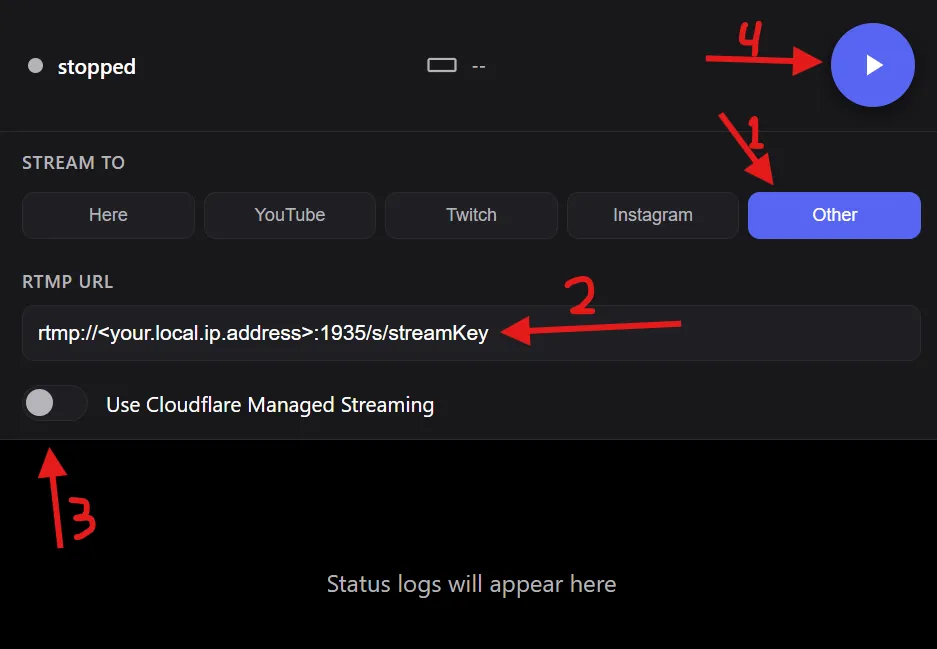

## How to run the run.py

```
brew install python@3.10 #macOS/linux

python3.10 -m venv .venv

source .venv/bin/activate #macOS/linux

python run.py
```

## How to local host a stream from glasses

### Prerequisites

-   Mentra live beta glasses are already paired to your computer and both are connected to the same 2G wifi. Learn more about it [here](#pairing-mentra-live-beta-glasses-to-your-computer)
-   The streamer app is downloaded from [here](https://apps.mentra.glass/)
-   ffplay is downloaded from [here](https://www.ffmpeg.org/download.html)

### Procedure
```
brew install mediamtx #macos Linux
```

Find your mediamtx.yml config file. On macs with apple silicon, this will be in /opt/homebrew/etc/mediamtx/mediamtx.yml. Then, replace the `paths:` section at the bottom with the following:
```
paths:
  all_others:

  all_streams:
    source: publisher
```

Open the Streamer app’s webview in MentraOS. Then select Stream to “Other”, enter in the rtmp url:
```
rtmp://<your.local.ip.address>:1935/s/streamKey
```
De-select “use Cloudflare managed streaming”, and then click the start button


Then, run the following two commands in separate terminals:
```
# Terminal 1
mediamtx <path to mediamtx.yml file>
```

```
# Terminal 2
ffplay rtmp://localhost:1935/s/streamKey
```

### Pairing Mentra live beta glasses to your computer

-   If anything ever goes wrong with the glasses: turn them off by holding the left button, and wait until you hear “System Ready” before pressing any buttons or trying to pair.
-   Hold the left temple button on the glasses until you hear “Power On”, then wait a minute or two until you hear the glasses say “system ready”.
    -   Do not press any other buttons or try to pair with the glasses until you hear the glasses say “system ready”.
-   Press the right button and if you hear a camera shutter sound effect or no sound, then you are good to continue. If you hear “not ready”, restart the glasses by holding the left button for a few seconds until you hear “power off”. Hold button again to power on.
-   Download the MentraOS app for your phone:
    -   iOS download Link: https://apps.apple.com/us/app/mentra-the-smart-glasses-app/id6747363193
    -   Android: https://play.google.com/store/apps/details?id=com.mentra.mentra&hl=en_US&pli=1
-   In the MentraOS app, login/signup and then pair new glasses
-   Select the Mentra Live, then select the glasses to pair.
    -   You may need to move away from other people and re-scan several times to determine the correct pair of glasses.
-   If the battery is below 20%, you will need to wait for the glasses to charge before continuing
-   Go to the “Glasses” page in the MentraOS app. Make sure the Build number is at least 13. If it’s not, wait for a few minutes for it to upgrade now that it’s connected to the WiFi. Don’t continue until it says 13.
